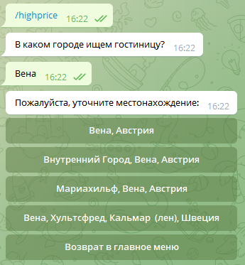
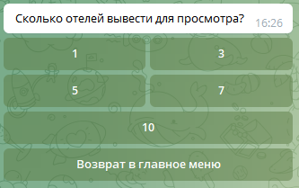
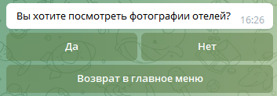
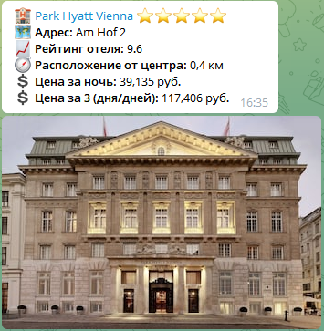

# Telegram bot для поиска отелей "HOT HOTEL BOT"

Бот предназначен для быстрого поиска отелей в мессенджере Telegram по заданным параметрам поиска.
Ссылка на бота - https://t.me/ice_9_bot

## Команды бота
* `/start` - автоматически запускает бота при подключении и отправляет приветственное сообщение и список команд для поиска
* `/lowprice` - поиск топ недорогих отелей
* `/highprice` - поиск топ отелей
* `/bestdeal` - поиск лучших предложений
* `/help` - список команд и их описание

## Работа бота на примере команды `/highprice`
1. запуск команды

2. необходимо ввести название искомого города и выбрать один из предложенных вариантов

3. выберите даты заезда и отъезда из гостиницы 

4. выберете нужное количество отелей для просмотра

5. необходимость вывода фотографий для отелей и их количество

6. результат работы бота

## Используемые сторонние библиотеки
* requests==2.28.0
* python-dotenv==0.20.0
* pyTelegramBotAPI==4.5.1
* loguru==0.6.0
* python-telegram-bot-calendar==1.0.5
* peewee==3.15.1